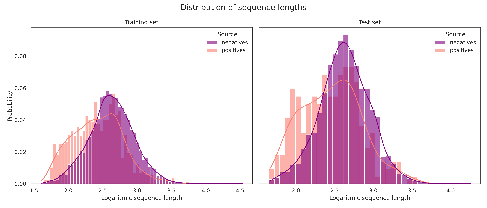
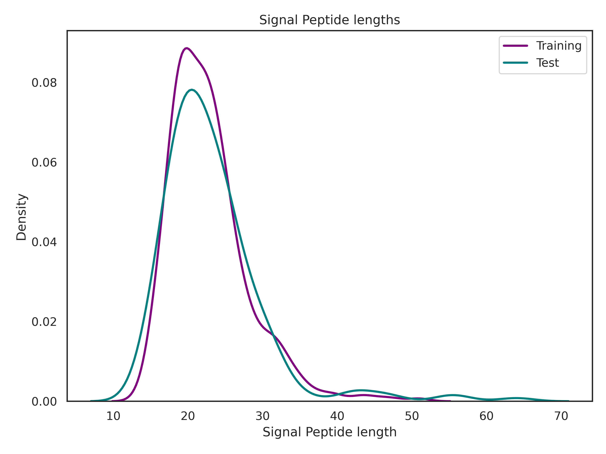
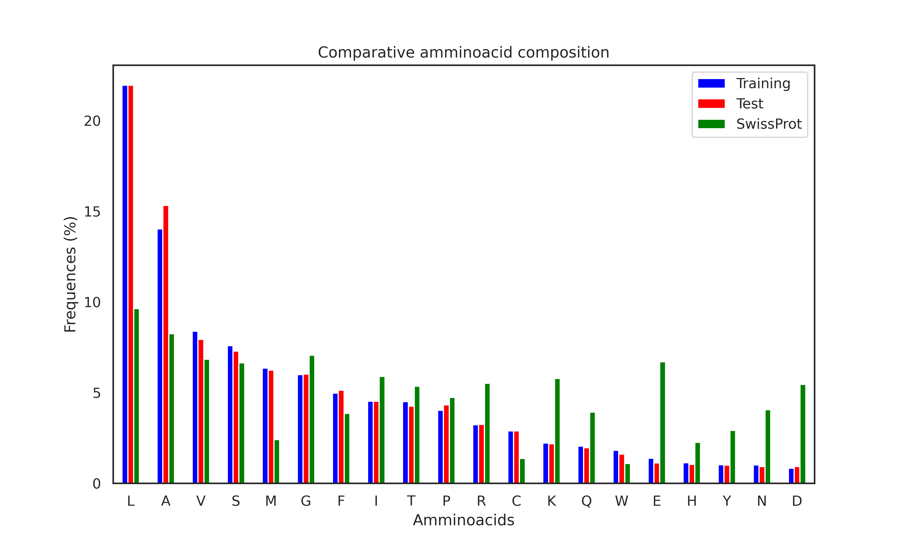
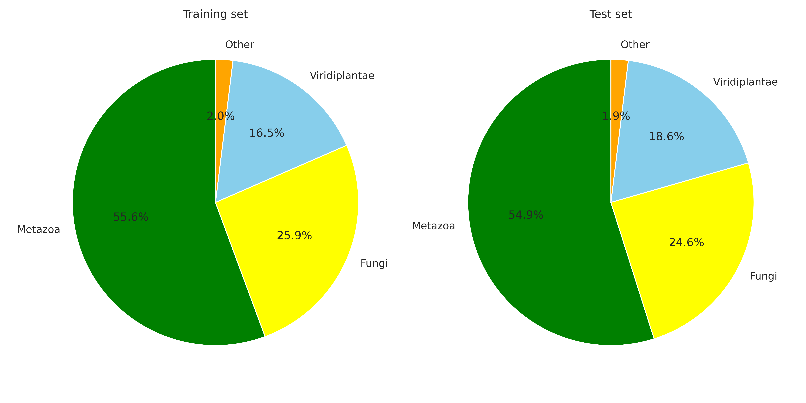

# Data analysis
In this step we explored data comparing training and test set 
## 1. Comparison between sequence length in positive and negative entries

## 2. Distributions of signal peptides lengths 

## 3. Comparison of the amminoacid composition of SPs between our datasets and SwissProt data

## 4. Taxonomic classification at kingdom and species level

## 5. Sequence logos
<figure>
 
  <figcaption><em>Sequence logo of the train set.</em></figcaption>
</figure>

<figure>
 
  <figcaption><em>Sequence logo of the test set.</em></figcaption>
</figure>
